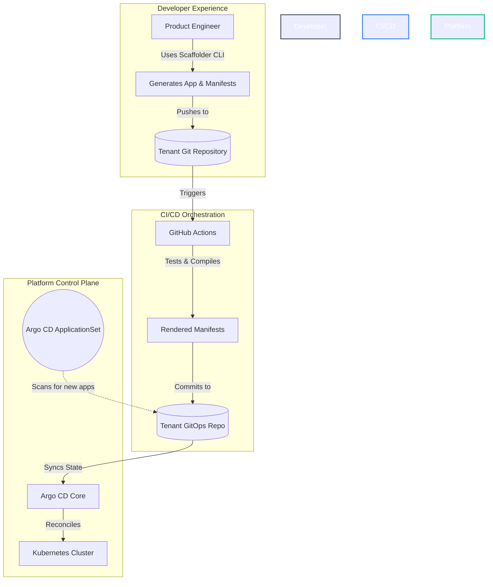

# 🏛️ Platform Engineering: IDP & GitOps Reference Architecture

An enterprise-grade **Internal Developer Platform (IDP)** blueprint designed for zero-touch onboarding, strict policy governance, and seamless multi-tenant continuous delivery via GitOps.

This repository serves as a reference architecture for platform teams looking to build "Local-to-Cloud" environments where developers are shielded from infrastructure complexity while retaining full deployment autonomy.

---

## 🏗️ Architecture Summary

As cloud-native architectures scale, cognitive load on product engineering teams becomes a critical bottleneck. This reference architecture implements a **Platform-as-a-Product** model using a "Control Plane" approach. 

By abstracting infrastructure and deployment patterns into declarative APIs and standardized templates, we enable:
* **Zero-Touch Provisioning:** Microservices are scaffolded and instantly deployed without platform team intervention.
* **Soft Multi-Tenancy:** Automated isolation of namespaces, network policies, and progressive delivery pipelines per product team.
* **Idempotent Infrastructure:** Splitting shared team infrastructure from app-specific infrastructure ensures manual Terraform modifications are safely preserved during subsequent app onboarding.
* **Guardrails over Gates:** Pre-flight compliance and security enforcement through admission controllers (Kyverno) rather than manual ticket reviews.

---

## 📂 Project Structure & Reading Guide (Start Here)

To make it easier to understand how this platform operates from end-to-end, the repository is logically divided into 4 chronological layers. If you are new to the platform, we recommend exploring the directories in this order:

1. **[`1-idp-scaffolder/`](file:///Users/karthik.orugonda/github/platform-engineering-idp-gitops-reference-architecture/1-idp-scaffolder/README.md) (Developer Experience & IDP Control Plane)**  
   The core engine of the platform's developer portal. A Python CLI and REST API utilizing **Typer**, **Copier**, and **Pydantic** to handle zero-touch microservice onboarding. Features deterministic IP Address Management (IPAM) for tenant VPCs, strict API contracts, and dual-pass template orchestration rendering parameterized Helm charts (`helm-charts/`) and flat ArgoCD manifests (`rendered-manifests/`). For more details, see the [Scaffolder README](file:///Users/karthik.orugonda/github/platform-engineering-idp-gitops-reference-architecture/1-idp-scaffolder/README.md).
2. **`2-tenant-workloads/` (Simulated Monorepo)**  
   *Note: Previously `generated-apps/`.* This acts as the simulated tenant source and GitOps monorepo where the scaffolded workloads reside. This directory is what ArgoCD monitors for new applications.
3. **`3-platform-argocd-apps/` (Control Plane Orchestration)**  
   Contains the ArgoCD "App of Apps" declarations. These are the high-level wrappers that orchestrate the deployment of the underlying platform infrastructure and GitOps synchronization.
4. **`4-platform-infrastructure/` (Control Plane Manifests)**  
   Contains the raw Kubernetes manifests and configurations for the core platform components (e.g., Traefik, OpenTelemetry, Gateway API) deployed by the layer above.

---

## 🗺️ Architectural Topologies

### 1. The GitOps Reconciliation Loop
This platform enforces a strict, unidirectional flow of state. Kubernetes is treated as the source of truth, and Argo CD acts as the reconciliation engine.



### 2. Zero-Touch Multi-Tenant Auto-Discovery
To scale across hundreds of microservices, we utilize **Argo CD ApplicationSets**. Instead of manually mapping each microservice to an Argo CD `Application` resource, our ApplicationSet uses a multi-level Git directory generator (`apps/*/*-gitops-repo/apps/*`) to dynamically provision and isolate tenant applications on the fly from the `2-tenant-workloads/` directory.

---

## 🧰 Component Matrix

This blueprint integrates best-in-class cloud-native tooling to form a cohesive ecosystem:

| Capability | Technology | Architectural Purpose |
| :--- | :--- | :--- |
| **Local Cluster** | **K3d (K3s)** | Lightweight, ephemeral Kubernetes environment optimized for ARM64/Silicon. |
| **GitOps Engine** | **Argo CD** | Declarative CD, state reconciliation, and multi-tenant auto-discovery. |
| **Infra as Code** | **Crossplane** | Abstracts AWS/Azure infrastructure into higher-level Kubernetes `Claims`. |
| **Policy as Code** | **Kyverno** | Admission control. Enforces cluster security boundaries and standards. |
| **Prog. Delivery** | **Argo Rollouts** | Automated Canary & Blue-Green deployments integrated with edge routing. |
| **Edge Gateway** | **Traefik** | L7 ingress, API gateway, rate-limiting, and middleware injection. |
| **Secrets Ops** | **Sealed Secrets** | Asymmetric encryption enabling safe storage of secrets in Git. |
| **Observability** | **Grafana Stack**| Unified metrics (Prometheus), logs (Loki), and traces (Tempo). |
| **Dep. Management**| **Renovate** | Automated dependency bumps for Terraform modules, Helm charts, and Python packages via custom Regex Managers. |

---

## 🚀 Deployment Guide (Local Demo Mode)

You can spin up this entire reference architecture locally to evaluate the developer experience and platform guardrails. We provide a `Makefile` to simplify the setup process.

### 1. Provision the Ephemeral Cluster
```bash
make create-cluster
```

### 2. Install the GitOps Engine (Argo CD)
```bash
make install-argocd
```

### 3. Bootstrap the Platform
The `bootstrap.yaml` file acts as the root of the "App of Apps" pattern. It points Argo CD to the `3-platform-argocd-apps/` directory to deploy all cluster add-ons simultaneously.
```bash
make bootstrap
```

> **Tip:** You can also run `make setup` to perform all cluster provisioning, Argo CD installation, and bootstrapping in one command.

### 4. Scaffold a New Microservice
Emulate a developer onboarding a new service. The generator builds the source code, pipelines, and GitOps configurations.
```bash
# Using python directly to run the entrypoint CLI subcommand 'create'
python 1-idp-scaffolder/main.py create \
  -a my-payment-service \
  -t springboot \
  -p 8080 \
  -team team-a
```

---

## 🛠️ Operations Guide

### Updating ArgoCD Applications
If you make changes to the YAML files inside the `3-platform-argocd-apps/` or `4-platform-infrastructure/` directories, ArgoCD is configured to automatically sync the changes from the `main` branch. 
To manually trigger a sync or force an update without waiting for Git polling, you can apply the bootstrap file again:
```bash
make bootstrap
```
Or force a sync via the ArgoCD CLI:
```bash
argocd app sync platform-bootstrap
```

### Tearing Down the Cluster
To delete the ephemeral cluster and completely destroy the environment, run:
```bash
make destroy
```
This will remove the cluster (via K3d/Kind/Minikube) and clean up all resources.

---

## 🔮 Future Roadmap

To mature this architecture for production environments, the following capabilities are roadmapped:

- [ ] **Backstage Integration:** Migrating the python CLI generator into Backstage Software Templates for a unified GUI developer portal.
- [ ] **AIOps / Observability:** Full instrumentation using OpenTelemetry to map service dependencies and reduce MTTR via correlation.
- [ ] **FinOps Automation:** Operator-driven cost controls to scale non-production idle workloads to zero using KEDA.
- [ ] **Cross-Cloud Capabilities:** Expanding Crossplane Compositions to support Azure AKS and GCP GKE multi-cloud environments.
