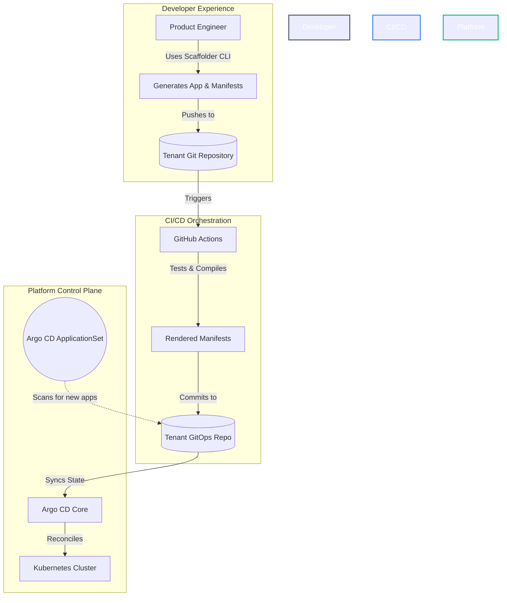

# 🏛️ Platform Engineering: IDP & GitOps Reference Architecture

An enterprise-grade **Internal Developer Platform (IDP)** blueprint designed for zero-touch onboarding, strict policy governance, and seamless multi-tenant continuous delivery via GitOps.

This repository serves as a reference architecture for platform teams looking to build "Local-to-Cloud" environments where developers are shielded from infrastructure complexity while retaining full deployment autonomy.

---

## 🎯 Executive Summary

As cloud-native architectures scale, cognitive load on product engineering teams becomes a critical bottleneck. This reference architecture implements a **Platform-as-a-Product** model using a "Control Plane" approach. 

By abstracting infrastructure and deployment patterns into declarative APIs and standardized templates, we enable:
* **Zero-Touch Provisioning:** Microservices are scaffolded and instantly deployed without platform team intervention.
* **Soft Multi-Tenancy:** Automated isolation of namespaces, network policies, and progressive delivery pipelines per product team.
* **Guardrails over Gates:** Pre-flight compliance and security enforcement through admission controllers (Kyverno) rather than manual ticket reviews.

---

## 🗺️ Architectural Topologies

### 1. The GitOps Reconciliation Loop
This platform enforces a strict, unidirectional flow of state. Kubernetes is treated as the source of truth, and Argo CD acts as the reconciliation engine.



### 2. Zero-Touch Multi-Tenant Auto-Discovery
To scale across hundreds of microservices, we utilize **Argo CD ApplicationSets**. Instead of manually mapping each microservice to an Argo CD `Application` resource, our ApplicationSet uses a multi-level Git directory generator (`apps/*/*-gitops-repo/apps/*`) to dynamically provision and isolate tenant applications on the fly.

---

## 🧰 Component Matrix

This blueprint integrates best-in-class cloud-native tooling to form a cohesive ecosystem:

| Capability | Technology | Architectural Purpose |
| :--- | :--- | :--- |
| **Local Cluster** | **K3d (K3s)** | Lightweight, ephemeral Kubernetes environment optimized for ARM64/Silicon. |
| **GitOps Engine** | **Argo CD** | Declarative CD, state reconciliation, and multi-tenant auto-discovery. |
| **Infra as Code** | **Crossplane** | Abstracts AWS/Azure infrastructure into higher-level Kubernetes `Claims`. |
| **Policy as Code** | **Kyverno** | Admission control. Enforces cluster security boundaries and standards. |
| **Prog. Delivery** | **Argo Rollouts** | Automated Canary & Blue-Green deployments integrated with edge routing. |
| **Edge Gateway** | **Traefik** | L7 ingress, API gateway, rate-limiting, and middleware injection. |
| **Secrets Ops** | **Sealed Secrets** | Asymmetric encryption enabling safe storage of secrets in Git. |
| **Observability** | **Grafana Stack**| Unified metrics (Prometheus), logs (Loki), and traces (Tempo). |

---

## 🚀 Deployment Guide (Local Demo Mode)

You can spin up this entire reference architecture locally to evaluate the developer experience and platform guardrails.

### 1. Provision the Ephemeral Cluster
```bash
# Creates a cluster and binds local ports for the Ingress controller
k3d cluster create idp-platform \
  --k3s-arg "--disable=traefik@server:0" \
  -p "80:80@loadbalancer" \
  -p "443:443@loadbalancer"
```

### 2. Install the GitOps Engine (Argo CD)
```bash
helm upgrade --install argocd argo/argo-cd \
  --namespace argocd \
  --reuse-values \
  --set server.extraArgs="{--insecure}" --create-namespace
```

### 3. Bootstrap the Platform
The `bootstrap.yaml` file acts as the root of the "App of Apps" pattern. It points Argo CD to the `platform-charts/` directory to deploy all cluster add-ons simultaneously.
```bash
kubectl apply -f bootstrap.yaml
```

### 4. Scaffold a New Microservice
Emulate a developer onboarding a new service. The generator builds the source code, pipelines, and GitOps configurations.
```bash
./scaffolder-generator/.venv/bin/python ./scaffolder-generator/cli.py \
  -a my-payment-service \
  -t springboot \
  -p 8080 \
  -team finance-team
```

---

## 🔮 Future Roadmap

To mature this architecture for production environments, the following capabilities are roadmapped:

- [ ] **Backstage Integration:** Migrating the python CLI generator into Backstage Software Templates for a unified GUI developer portal.
- [ ] **AIOps / Observability:** Full instrumentation using OpenTelemetry to map service dependencies and reduce MTTR via correlation.
- [ ] **FinOps Automation:** Operator-driven cost controls to scale non-production idle workloads to zero using KEDA.
- [ ] **Cross-Cloud Capabilities:** Expanding Crossplane Compositions to support Azure AKS and GCP GKE multi-cloud environments.
